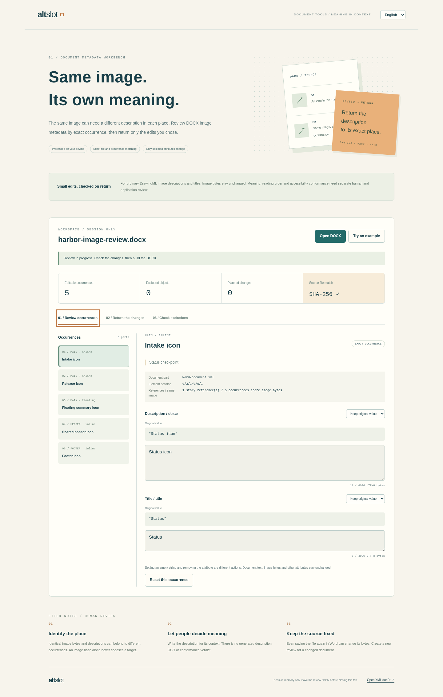

# AltSlot

**同じ画像でも、意味はその場所にある。**



Actual tested interface. [Japanese mobile](docs/evidence/browser/mobile-edit-ja.png) · [Selective return review](docs/evidence/browser/desktop-return-en.png)

AltSlot is a local DOCX image-metadata review workbench. It exports editable description/title records for exact drawing occurrences, accepts reordered or selective returns, and patches only the chosen `wp:docPr` attributes in the exact original file.

Repeated image bytes, repeated descriptions and blank descriptions stay distinct. A shared header is one stored occurrence even when an application displays it on several pages. Reviewers decide the wording; AltSlot does not generate descriptions or claim accessibility conformance.

## Try it

Requires Node.js 22+; Python 3.10+ runs the independent development oracle.

```sh
npm ci --ignore-scripts
npm run build
npm run serve
# http://127.0.0.1:4173
```

The static `dist/` folder supports a nested deployment path. The application has no external runtime dependency, upload endpoint, analytics, browser storage or document connection. Its JavaScript, worker and sample are served from the same origin. Uploaded document bytes are processed in a worker on the user's device; package relationships are never fetched. Offline reload or new-worker startup is not promised.

1. Open the sample or a supported DOCX
2. Review each occurrence's document part, element position and nearby text
3. Choose **keep**, **set**, or **remove** independently for description and title
4. Save a review JSON, or import a returned one; record order does not matter and omitted records stay untouched
5. Inspect the before/after table, then build and verify the DOCX
6. Download the updated document, JSON receipt and escaped printable HTML review

日本語・英語の画面を切り替えられます。作業はタブのメモリ内だけに保持されます。閉じる前にレビューJSONを保存してください。元のDOCXをWord等で保存し直した場合は、そのファイルから新しくレビューを作成してください。

## Deliberate editing boundary

Supported packages are unsigned, unencrypted, macro-free **Transitional DOCX**. Scanned stories are the main document and explicitly reachable headers/footers. Supported carriers are ordinary DrawingML inline or anchored pictures with one internal image relationship and one outer `wp:docPr`.

Tracked contexts, VML/embedded objects, charts, SmartArt, grouped/alternate content, external images, decorative metadata and competing nonempty picture-level descriptions are visible exclusions. Footnotes, endnotes, comments, glossary and unreferenced stories are not scanned. Unsupported packages or resource limits fail explicitly. This is a bounded metadata editor, not a complete OOXML validator.

Only `descr` and `title` can be changed. Setting `""` preserves an empty attribute; removing means the attribute is absent. All unaffected ZIP member **payload bytes** and local member records are copied unchanged. Selected XML is patched at the chosen attribute spans; it is not reserialized. Central-directory offsets and the selected member's compression may change. With no actual value change, the entire DOCX remains byte-identical.

A file digest is an identity check, **not a signature, permission check or reviewer-authentication mechanism**. A person who has the document can author a new valid packet. The tool prevents accidental/stale mismatches; it cannot establish who approved a description.

## Verification

```sh
npm run check
node scripts/emit_example.mjs
```

The final local aggregate passed 48 tests, including 13 independent reviewer cases. The suite covers byte ownership, packet identities, duplicate JSON keys, bounded XML/ZIP processing, exact attribute edits, no-op identity and actual interrupted UI handlers. Independent Python `zipfile`, ElementTree and Expat compare literal expected metadata and unchanged member/XML bytes. The emitted reviewed DOCX has also been rendered through LibreOffice and its two pages are pixel-identical to the source.

The [verified hosted run](https://github.com/Masanori-Spec/alt-slot/actions/runs/37185453748) passed both Node 22/24 engines, all **14 sandboxed Chromium scenarios**, and the document job. **Open XML SDK 3.3.0 validated four DOCX files with zero errors**: the source, emitted edited output, actual browser-downloaded edited output and no-op download. Both edited outputs retain the source's two-page rendering exactly within each LibreOffice comparison.

Eight actual browser screenshots, both one-page browser print outputs and DOCX render evidence were inspected. The exact downloaded review packet, receipt and DOCX are retained together. No native Word, screen-reader, accessibility-conformance or broad real-world-document compatibility pass is claimed. [Verification details](docs/VERIFICATION.md) · [Visual and document review](docs/VISUAL_REVIEW.md).

## Engineering notes

- [Format, matching and bounds](docs/FORMAT.md)
- [Integration example](docs/INTEGRATION.md)
- [Existing tools and scope comparison](docs/COMPARISON.md)
- [Interview walkthrough](docs/INTERVIEW.md)
- [Privacy and limits](SECURITY.md)

No project license grant was added. Development and fixture-tool notices are retained in [THIRD_PARTY_NOTICES.md](THIRD_PARTY_NOTICES.md). The examples contain only synthetic text and a generated geometric icon.
